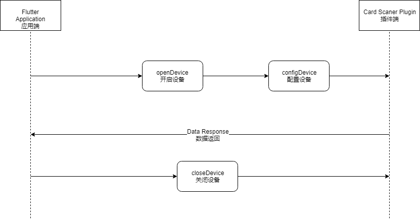

# card_scaner

CH34 Card Scaner，刷卡器Flutter插件，内部项目使用

芯片使用的是[沁恒的方案](http://www.wch.cn/products/CH340.html)


## 应用调用插件方式




* 应用端向插件端发送[开启设备]方法调用，这时会查找串口设备，并启动串口设备
* 应用端向插件端发送[配置设备]方法调用，这时会将设备进行默认配置（暂时还不支持自定义配置，后期会增加），串口开始监听数据，当有数据接收时，会向应用端发送
* 应用端向插件端发送[关闭设备]方法调用，守时会将开启的设备进行关闭，后台插件线程取消


## 插件使用说明

安装插件（pubspec.yaml）

```
dependencies:
  # 刷卡器插件集成至系统，刷卡器是自己基于CH34开发
  card_scaner:
    git:
      url: https://github.com/ChenWes/card_scaner
      ref: main
```

引用插件

```
import 'package:card_scaner/card_scaner.dart';
```

使用插件（首先打开设备，监听设备返回值，应用退出时，需要关闭设备）

```
  /// 打开并配置刷卡设备
  void openAndConfigCardScanerDevice() async {
    // 打开设备
    await CardScaner.openDevice;

    // 不声明变量获取回调函数，获取刷卡数据，并且需要回调响应刷卡动作
    CardScaner.receiveStream.listen((event) {
      print("返回的刷卡数据" + event.toString());

      // 刷卡响应方法
      XXXX(event.toString());
    }, onError: (error) {
      print("刷卡出现错误：" + error.toString());
    });
  }
  
  
  /// 关闭刷卡设备
  void closeCardScanerDevice() async {
    CardScaner.closeDevice;
  }
```

## 特别注意

CH34芯片是通过使用串口的方式集成到Android的主板上，那么打开方式也即是通过串口的方式打开，目前在Android 11系统上打开串口，是在每次系统启动后再去扫描串口设备。

所以在应用安装后，每次打开串口设备都需要弹出对话框获取权限，那这样集成至MES系统肯定是不方便的，所以在应用的前面还做了一个辅助应用，这个辅助应用每次都会开机启动，它的作用是时刻监控MES系统应用的ID，每当MES系统应用弹出对话框时，它会默认点击确认，省去了用户点击的过程，从而达到一个自动的目的。

辅助应用源码地址：https://github.com/ChenWes/cf-mes-client-crossplatform-helper